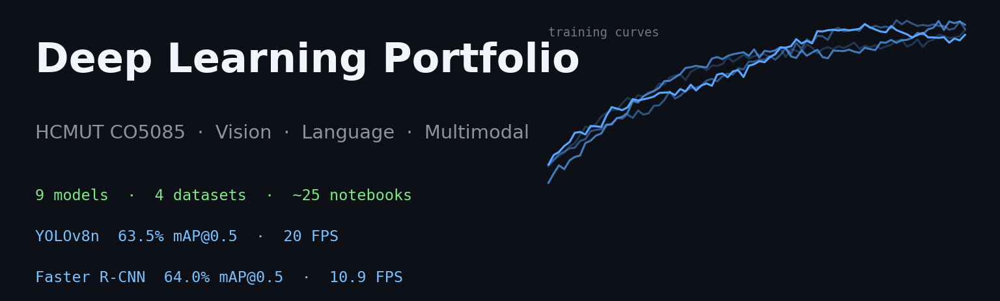

# Deep Learning Portfolio — HCMUT CO5085

<p align="center">
  
</p>

A three-chapter portfolio covering image, language, and multimodal deep learning — from architectures built from first principles to pretrained models fine-tuned on standard benchmarks.

[](https://www.python.org/)
[](https://pytorch.org/)
[](LICENSE)
[](https://phongnguyentrung.github.io/hcmut-deeplearning-ass1/)

Course CO5085 · ĐH Bách Khoa TP.HCM (HCMUT) · 2025–2026 HK2 · Instructor: Lê Thành Sách

---

## Three chapters

| # | Project | Domain | Details |
|---|---|---|---|
| 1 | Multi-domain comparison: CNN vs ViT, RNN vs Transformer, CLIP zero/few-shot | Image · Text · Multimodal | [docs](https://phongnguyentrung.github.io/hcmut-deeplearning-ass1/ass1.html) |
| 2 | Architecture engineering from scratch on CIFAR-100 | Computer Vision | [`exercise/`](exercise/README.md) |
| 3 | One-stage vs two-stage object detection on Pascal VOC 2012 | Object Detection | [`exercise_2/`](exercise_2/README.md) |

All three are physically separate (each has its own `src/`, `scripts/`, `notebooks/`, `results/`) — unified only at the documentation and CI level.

Live site: [phongnguyentrung.github.io/hcmut-deeplearning-ass1](https://phongnguyentrung.github.io/hcmut-deeplearning-ass1/)

## Quick start

```bash
git clone https://github.com/PhongNguyenTrung/hcmut-deeplearning-ass1.git
cd hcmut-deeplearning-ass1

python3 -m venv .venv
source .venv/bin/activate
pip install torch torchvision           # auto-detects CUDA / MPS / CPU
pip install -r requirements.txt
python -m ipykernel install --user --name=deeplearning-ass1
```

Each chapter has its own training commands — see the relevant subfolder README.

## Repository layout

```
hcmut-deeplearning-ass1/
├── README.md                ← this file
├── LICENSE
├── requirements.txt
│
├── src/, scripts/, notebooks/, results/   ← Chapter 1 (top-level)
│
├── exercise/                ← Chapter 2 — see exercise/README.md
├── exercise_2/              ← Chapter 3 — see exercise_2/README.md
│
├── docs/                    ← GitHub Pages site
├── data/                    ← datasets (gitignored)
└── .github/workflows/       ← CI: lint + notebook validation
```

## Citation

```bibtex
@misc{nguyen2026dlportfolio,
  author       = {Nguyễn, Trung Phong},
  title        = {Deep Learning Portfolio: Pretrained Fine-tuning, Architecture
                  Engineering, and Object Detection on Pascal VOC, CIFAR-100,
                  and 20 Newsgroups},
  year         = {2026},
  howpublished = {\url{https://github.com/PhongNguyenTrung/hcmut-deeplearning-ass1}},
  note         = {CO5085, HCMUT}
}
```

## Acknowledgments

- Course and advising: Lê Thành Sách (CO5085, HCMUT)
- Pretrained backbones: [torchvision](https://pytorch.org/vision), [HuggingFace Transformers](https://huggingface.co/transformers), [OpenAI CLIP](https://github.com/openai/CLIP), [ultralytics](https://github.com/ultralytics/ultralytics)
- Datasets: Pascal VOC, CIFAR-100 (Krizhevsky), 20 Newsgroups (Lang), Flickr30k (Young et al.)
- Compute: PyTorch with auto-device (CUDA / MPS / CPU)

---

Author: Nguyễn Trung Phong · [github.com/PhongNguyenTrung](https://github.com/PhongNguyenTrung) · phong.nguyen.1911qrs@gmail.com
