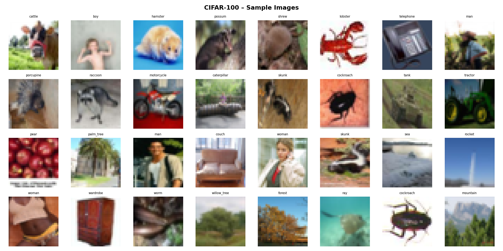
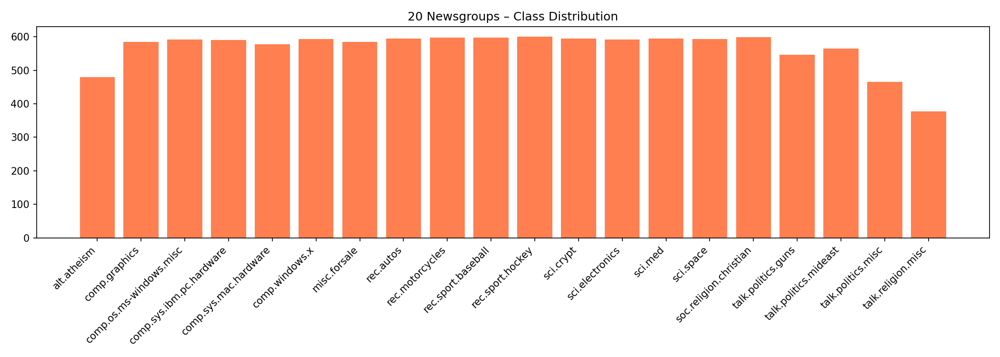
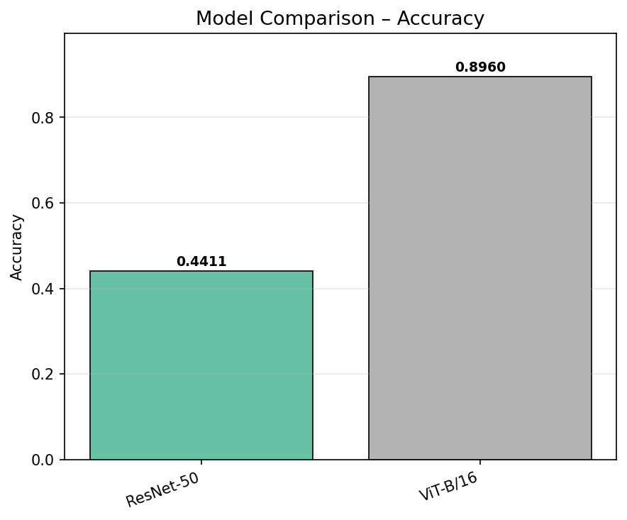
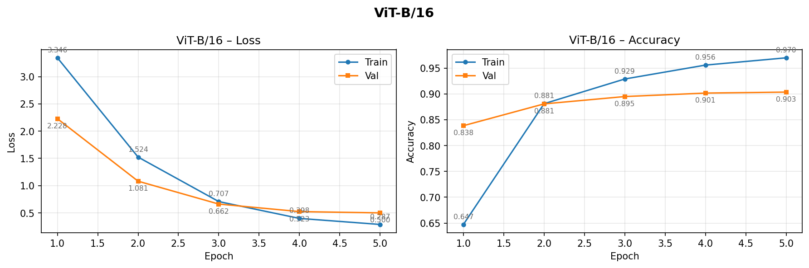
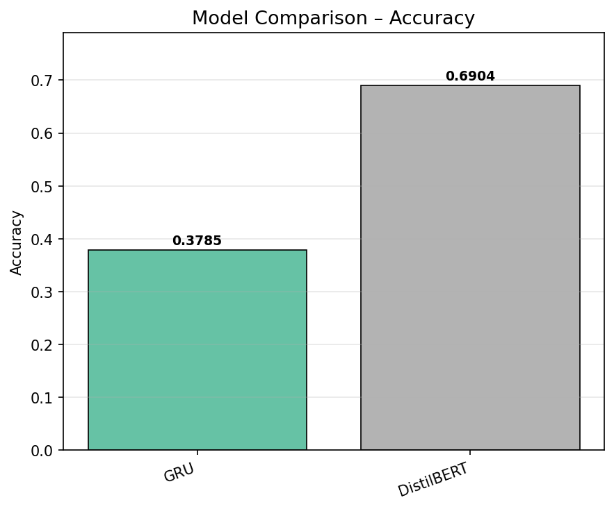
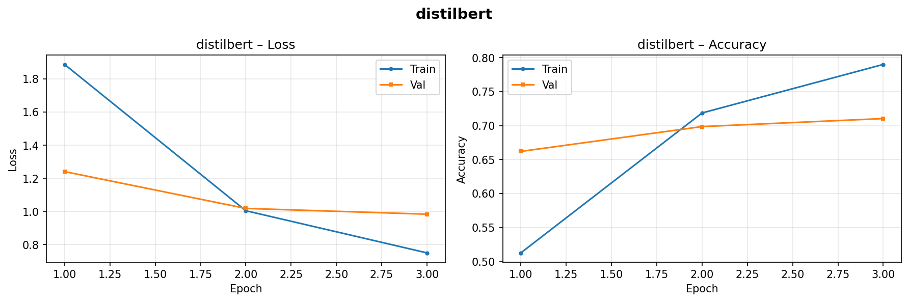
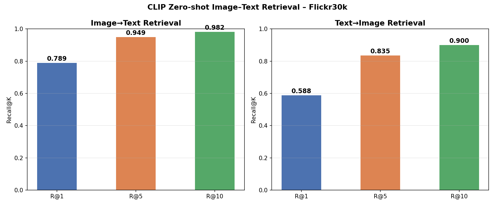
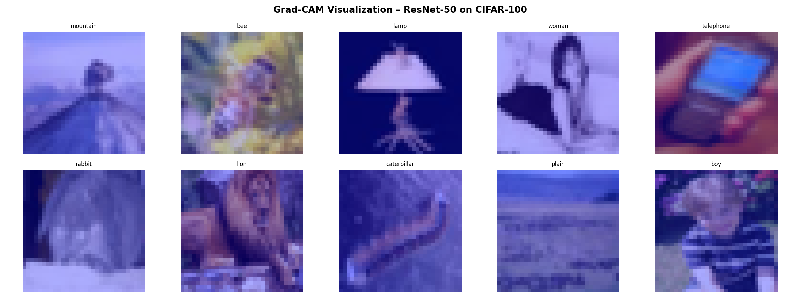
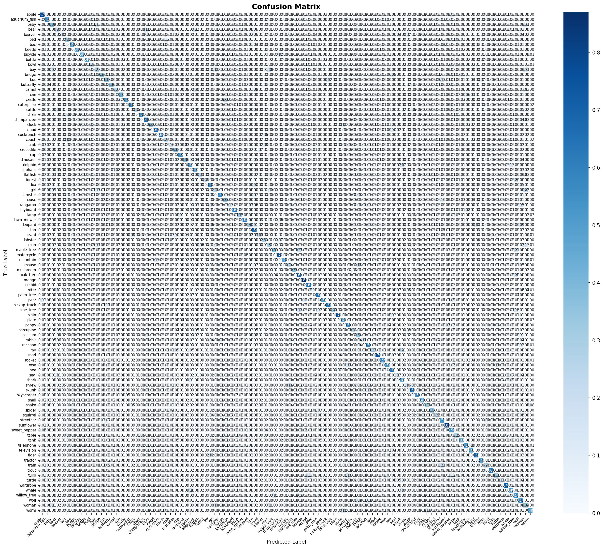

<!-- _class: title-slide -->

# So sánh Kiến trúc Deep Learning
## CNN vs. ViT · RNN vs. Transformer · Zero-shot vs. Few-shot

<br>

| | |
|---|---|
| **Môn học** | CO5085 – Deep Learning & Computer Vision Applications |
| **Sinh viên** | Nguyễn Trung Phong – MSSV: 2570047 |
| **Giảng viên** | Lê Thành Sách |
| **Học kỳ** | 2 / 2025–2026 – HCMUT |

---

## Nội dung trình bày

| # | Nội dung | Slides |
|---|---|---|
| 1 | Bối cảnh & Câu hỏi nghiên cứu | 3 |
| 2 | Cơ sở lý thuyết (CNN, ViT, GRU, DistilBERT, CLIP) | 4–6 |
| 3 | Dữ liệu & Tiền xử lý (EDA) | 7–8 |
| 4 | **Task 1** – Phân loại ảnh: ResNet-50 vs. ViT-B/16 | 9–11 |
| 5 | **Task 2** – Phân loại văn bản: GRU vs. DistilBERT | 12–14 |
| 6 | **Task 3** – CLIP Zero-shot Image–Text Retrieval (Flickr30k) | 15–16 |
| 7 | **Extensions** – Grad-CAM, Error Analysis, Fine-tune, Demo | 17–20 |
| 8 | Thảo luận & Kết luận | 21–23 |

---

## 1. Bối cảnh & Câu hỏi nghiên cứu

### Động lực

- **CNN** và **RNN** từng là kiến trúc chủ đạo trong CV và NLP suốt hơn một thập kỷ
- Từ 2017–2021, kiến trúc **Transformer** lần lượt chinh phục NLP (BERT), CV (ViT), và multimodal (CLIP)
- Câu hỏi thực tiễn: khi nào nên dùng Transformer thay CNN/RNN, và chi phí là bao nhiêu?

### Ba câu hỏi nghiên cứu

> **Q1.** ResNet-50 (CNN) hay ViT-B/16 (Vision Transformer) tốt hơn trên CIFAR-100?

> **Q2.** GRU (RNN) hay DistilBERT (Transformer) tốt hơn trên 20 Newsgroups?

> **Q3.** CLIP có thể tìm kiếm ảnh–văn bản (retrieval) hiệu quả trên dataset thật (Flickr30k) mà không cần training không?

---

<!-- _class: section-header -->

# Cơ sở lý thuyết
## CNN · ViT · GRU · DistilBERT · CLIP

---

## 2. Kiến trúc Image: CNN vs. ViT

### ResNet-50 — CNN với Skip Connection

- Tích chập cục bộ (3×3 kernel) → học đặc trưng theo vùng ảnh
- **Skip connection:** $\mathbf{y} = F(\mathbf{x}) + \mathbf{x}$ giải quyết vanishing gradient, cho phép train mạng rất sâu
- Receptive field tăng dần qua các lớp → từ texture → shape → semantic
- 25.6M params · Pre-train: ImageNet-1K (1.2M ảnh)

### ViT-B/16 — Vision Transformer

- Chia ảnh 224×224 thành **196 patch 16×16**, mỗi patch → 1 token embedding
- Thêm `[CLS]` token + positional encoding → đưa vào 12 Transformer encoder layers
- **Multi-head self-attention** (12 heads): $\text{Attn}(Q,K,V) = \text{softmax}\!\left(\frac{QK^T}{\sqrt{d_k}}\right)V$
- Cho phép mọi patch "nhìn thấy" mọi patch ngay từ layer đầu — không bị giới hạn receptive field
- 86M params · Pre-train: **ImageNet-21K** (14M ảnh)

---

## 2. Kiến trúc Text: GRU vs. DistilBERT

### GRU — Gated Recurrent Unit

- Xử lý chuỗi **tuần tự** token-by-token, mang theo hidden state $h_t$
- **Reset gate** $r_t$ và **Update gate** $z_t$ kiểm soát thông tin được nhớ/quên
- Bidirectional: đọc chuỗi theo cả 2 chiều → nắm bắt ngữ cảnh trước và sau
- Hạn chế: **sequential bottleneck** — không song song hóa được; khó học **long-range dependency**
- ~4M params · Khởi tạo **ngẫu nhiên** (không pre-train)

### DistilBERT — Transformer nén từ BERT

- **Self-attention toàn cục**: xử lý đồng thời toàn bộ chuỗi, không có thứ tự tuyến tính
- 6 Transformer layers (thay vì 12 của BERT), dùng **knowledge distillation** giữ lại 97% hiệu năng
- Pre-train: **Masked Language Model** trên Wikipedia + BookCorpus (~16GB text)
- 66M params · Fine-tune với `lr=2e-5` → head phân loại `Linear(768→20)`

---

## 2. CLIP — Contrastive Language–Image Pretraining

### Kiến trúc & Huấn luyện

- **Image encoder** (ViT-B/32) + **Text encoder** (Transformer) được train cùng nhau
- Mục tiêu: cặp ảnh-văn bản thật → cosine similarity **cao**; cặp không khớp → similarity **thấp**
- Pre-train trên **400 triệu** cặp ảnh-văn bản thu thập từ Internet
- Kết quả: **không gian embedding chung** — ảnh và văn bản mô tả cùng khái niệm nằm gần nhau

### Ứng dụng: Zero-shot Image–Text Retrieval

**Pipeline (không training):**
1. Encode ảnh → $\mathbf{v} = \text{Enc}_I(x) / \|\text{Enc}_I(x)\|$
2. Encode caption → $\mathbf{t} = \text{Enc}_T(c) / \|\text{Enc}_T(c)\|$
3. Similarity: $s(\mathbf{v}, \mathbf{t}) = \mathbf{v} \cdot \mathbf{t}^\top$

**Đánh giá – Recall@K** trên Flickr30k test (1,000 ảnh × 5 captions):
- **I→T**: Cho ảnh, rank 5,000 captions → R@K = tỉ lệ tìm được caption đúng trong top-K
- **T→I**: Cho caption, rank 1,000 ảnh → R@K = tỉ lệ tìm được ảnh đúng trong top-K

---

<!-- _class: section-header -->

# Dữ liệu & Tiền xử lý
## EDA – CIFAR-100 · 20 Newsgroups · Flickr30k

---

## 3. EDA – Dữ liệu Hình ảnh (CIFAR-100)

**60,000 ảnh màu 32×32 · 100 fine-grained class · 20 superclass**
- Train: 50,000 (500 ảnh/class) · Test: 10,000 (100 ảnh/class) — **cân bằng hoàn toàn**

### Pipeline tiền xử lý

| Split | Bước xử lý |
|---|---|
| **Train** | `RandomCrop(32, pad=4)` → `RandomHorizontalFlip` → `ColorJitter(0.2)` → `Normalize` |
| **Val/Test** | `ToTensor` → `Normalize(μ=[0.507,0.487,0.441], σ=[0.267,0.256,0.276])` |
| **ViT-B/16** | Thêm `Resize(256)` → `CenterCrop(224)` trước Normalize |

> **Thách thức:** Độ phân giải 32×32 rất thấp — các class trong cùng superclass dễ bị nhầm lẫn; ViT được pre-train ở 224×224 nên bị bất lợi nhẹ ở bước resize.



---

## 3. EDA – Dữ liệu Văn bản & Multimodal

### 20 Newsgroups

- ~18,000 bài đăng · 20 chủ đề (politics, sports, science, religion…)
- Lọc `remove=('headers','footers','quotes')` → chỉ giữ nội dung chính
- Train: ~11,314 · Test: ~7,532

**Đặc điểm phân phối:**
- Độ dài văn bản dao động lớn (50 → 5,000+ từ) → truncate tại **max_length=256**
- Phân phối class tương đối cân bằng (~550–600 bài/class)

### Flickr30k (Multimodal Retrieval Dataset)

- **31,783 ảnh** thật, mỗi ảnh có **5 captions** do con người viết
- Test split chính thức: **1,000 ảnh × 5 captions = 5,000 pairs** (tải từ `AnyModal/flickr30k`)
- Không cần gán nhãn — dùng trực tiếp cặp (ảnh, caption) làm ground truth cho retrieval



---

<!-- _class: section-header -->

# Task 1 – Phân loại Ảnh
## ResNet-50 (CNN) vs. ViT-B/16 (Vision Transformer)

---

## 4. Task 1 – Cài đặt thực nghiệm

| | ResNet-50 | ViT-B/16 |
|---|---|---|
| **Kiến trúc** | CNN, Residual blocks | Transformer, Patch 16×16 |
| **Tham số** | 25.6M | 86M |
| **Pre-train** | ImageNet-1K (1.2M ảnh) | ImageNet-21K (14M ảnh) |
| **Classification head** | `Dropout(0.3) + FC(2048→100)` | `FC(768→100)` |
| **Fine-tune** | Toàn bộ mạng | Toàn bộ mạng |
| **Learning rate** | `1×10⁻³` | `5×10⁻⁵` (nhỏ hơn để tránh phá vỡ pre-trained features) |
| **Epochs** | 5 | 5 |
| **Batch size** | 128 | 32 |
| **Scheduler** | CosineAnnealingLR | CosineAnnealingLR |
| **Gradient clipping** | max_norm=1.0 | max_norm=1.0 |

> Cả hai được fine-tune toàn bộ trên CIFAR-100. Hardware: Apple M-series (MPS, float32).

---

## 4. Task 1 – Kết quả

| Model | Test Accuracy | F1-Macro | Gap |
|---|---|---|---|
| ResNet-50 (CNN) | 44.11% | 0.434 | baseline |
| **ViT-B/16 (Transformer)** | **89.60%** | **0.896** | **+45.49 pp** |

### Phân tích

- ViT-B/16 vượt ResNet-50 gần **2×** (89.60% vs 44.11%)
- **Self-attention toàn cục**: ViT học quan hệ giữa tất cả 196 patch ngay từ layer đầu tiên; ResNet chỉ nhìn vùng 3×3 ở mỗi bước
- ResNet gặp khó khăn do ảnh nhỏ 32×32 — inductive bias của convolution không phù hợp
- Lưu ý: ViT pre-train trên **14M ảnh** (ImageNet-21K) vs ResNet 1.2M → **lợi thế dữ liệu 11×** cần tính đến



---

## 4. Task 1 – Training Curves

- **ResNet-50**: val accuracy tăng ổn định, hội tụ nhanh ở epoch 3–4, dấu hiệu nhẹ overfitting cuối
- **ViT-B/16**: khởi đầu chậm hơn (epoch 1–2 thấp), sau đó tăng nhanh mạnh — đặc trưng của Transformer cần "warm-up" để thích nghi với task mới
- Train loss ViT hội tụ tốt, val loss không tăng → không overfitting trong 5 epochs



---

<!-- _class: section-header -->

# Task 2 – Phân loại Văn bản
## GRU (RNN) vs. DistilBERT (Transformer)

---

## 5. Task 2 – Cài đặt thực nghiệm

| | GRU | DistilBERT |
|---|---|---|
| **Kiến trúc** | Bidirectional RNN, 2 layers | Transformer, 6 layers |
| **Tham số** | ~4M | 66M |
| **Pre-train** | **Không** — khởi tạo ngẫu nhiên | Wikipedia + BookCorpus (~16GB) |
| **Embedding** | DistilBERT tokenizer, embed_dim=300 | Learned embeddings (pre-trained) |
| **Classification head** | `FC(512→20)` (hidden×2) | `FC(768→20)` |
| **Learning rate** | `1×10⁻³` | `2×10⁻⁵` |
| **Epochs** | 5 | 3 |
| **Batch size** | 64 | 32 |
| **Max sequence length** | 256 tokens | 256 tokens |

> Cả hai cùng dùng `DistilBertTokenizer` (vocab=30,522) để tokenize → **embedding space đồng nhất**, chỉ khác kiến trúc xử lý.

---

## 5. Task 2 – Kết quả

| Model | Test Accuracy | F1-Macro | Gap |
|---|---|---|---|
| GRU (RNN) | 37.85% | 0.361 | baseline |
| **DistilBERT (Transformer)** | **69.04%** | **0.668** | **+31.19 pp** |

### Phân tích

- DistilBERT vượt GRU **+31.2 điểm** — khoảng cách lớn nhất trong 3 domain
- **GRU**: xử lý tuần tự → không song song, khó học long-range dependency ở max_length=256
- **DistilBERT**: self-attention song song toàn chuỗi + pre-train trên 16GB văn bản → representations giàu ngữ nghĩa
- GRU không có pretrained embeddings → phải học từ đầu trên ~11K bài — quá ít để khái quát hóa tốt

> **Kết luận**: Với NLP, **pre-training** là yếu tố quyết định hơn kiến trúc đơn thuần.



---

## 5. Task 2 – Training Curves

- **GRU**: val accuracy đạt ~35–38% và bão hòa sớm — training loss tiếp tục giảm nhưng val loss tăng nhẹ → overfitting
- **DistilBERT**: chỉ cần **3 epochs** để đạt 69% — tốc độ hội tụ vượt trội nhờ pretrained representations
- DistilBERT val loss giảm đều, không có dấu hiệu overfitting trong 3 epochs



---

<!-- _class: section-header -->

# Task 3 – Multimodal Learning
## CLIP Zero-shot Image–Text Retrieval · Flickr30k

---

## 6. Task 3 – Phương pháp & Cài đặt

**Dataset:** Flickr30k test split — 1,000 ảnh × 5 captions = **5,000 image–caption pairs**

**Pipeline (zero-shot, không training):**

1. Encode 1,000 ảnh → $\mathbf{V} \in \mathbb{R}^{1000 \times 512}$ (L2-normalized)
2. Encode 5,000 captions → $\mathbf{T} \in \mathbb{R}^{5000 \times 512}$ (L2-normalized)
3. Similarity matrix $\mathbf{S} = \mathbf{V} \cdot \mathbf{T}^\top$

**Đánh giá – Recall@K:**

| Hướng | Ý nghĩa |
|---|---|
| **Image→Text** | Cho ảnh, tìm caption đúng trong 5,000 captions |
| **Text→Image** | Cho caption, tìm ảnh đúng trong 1,000 ảnh |

---

## 6. Task 3 – Kết quả CLIP Retrieval

| Hướng Retrieval | **R@1** | **R@5** | **R@10** |
|---|---|---|---|
| **Image→Text (I→T)** | **78.90%** | **94.90%** | **98.20%** |
| **Text→Image (T→I)** | **58.78%** | **83.48%** | **90.02%** |

### Phân tích

- **I→T mạnh hơn T→I**: Mỗi ảnh có 5 captions ground truth → dễ hit top-K hơn; T→I chỉ có 1 ảnh đúng trong 1,000 → khó hơn
- **R@1 I→T = 78.9%** zero-shot — không training, không labeled data → CLIP embedding space đủ phân ly
- **R@10 I→T = 98.2%**: Gần như luôn tìm được caption đúng trong top-10
- Kém SOTA có supervision (~90%+ R@1) khoảng 11 điểm — trade-off hoàn toàn hợp lý khi **không cần training**



---

<!-- _class: section-header -->

# Extensions
## Grad-CAM · Error Analysis · Fine-tuning · Demo

---

## 7. Extension 1 – Grad-CAM: Khả năng Diễn giải CNN

**Gradient-weighted Class Activation Mapping** (Selvaraju et al., 2017)

**Nguyên lý:** Tính gradient của class score theo feature map của `layer4` → weighted sum → heatmap vị trí quan trọng

$$L^c_{\text{Grad-CAM}} = \text{ReLU}\!\left(\sum_k \alpha_k^c A^k\right), \quad \alpha_k^c = \frac{1}{Z}\sum_{i,j}\frac{\partial y^c}{\partial A^k_{ij}}$$

**Kết quả trên ResNet-50:**
- Heatmap bao phủ đúng **vùng đối tượng chính** — không bị thu hút bởi background
- Layer cuối (`layer4`) học đặc trưng **ngữ nghĩa cấp cao** (hình dạng tổng thể), không phải texture/màu sắc
- Cho thấy mô hình học đúng cách — không shortcut vào background



---

## 7. Extension 2 – Error Analysis: Phân tích Lỗi ResNet-50

**Confusion matrix** của ResNet-50 trên 100 class CIFAR-100:

**Xu hướng lỗi chính:**
- Phần lớn lỗi xảy ra **trong cùng superclass**: nhầm `beaver` ↔ `otter` (small mammals), `bus` ↔ `train` (vehicles)
- Ít lỗi xuyên superclass: không nhầm `dog` với `airplane`
- Điều này cho thấy mô hình đã học được phân biệt ở mức **superclass** nhưng chưa đủ tinh tế ở **fine-grained**

**Nguyên nhân:** Độ phân giải 32×32 quá thấp — các class cùng superclass trông gần như giống nhau ở kích thước này



---

## 7. Extension 3 – Fine-tuning Strategies

So sánh hai chiến lược trên ResNet-50 (CIFAR-100):

| Chiến lược | Params được update | Đặc điểm | Khi nào dùng |
|---|---|---|---|
| **Freeze Backbone** | Chỉ classification head (~200K) | Hội tụ nhanh, tránh catastrophic forgetting | Dataset nhỏ (<10K), tính toán hạn chế |
| **Full Fine-tune** | Toàn bộ 25.6M params | Accuracy cao hơn, cần lr nhỏ và gradient clipping | Dataset đủ lớn (≥50K), như CIFAR-100 |

**Kết quả:** Full Fine-tune cho accuracy cao hơn rõ rệt với 50K ảnh train — toàn bộ feature extractor được tối ưu cho domain 32×32 CIFAR.

**Rủi ro của Full Fine-tune:** Learning rate quá lớn có thể phá vỡ pretrained features → dùng **CosineAnnealingLR** + **gradient clipping (max_norm=1.0)** để ổn định.

> **Khuyến nghị thực tế:** Freeze backbone trước 1–2 epochs để "warm-up" head, rồi unfreeze toàn bộ — giảm nguy cơ catastrophic forgetting.

---

## 7. Extension 4 – Gradio Demo App

Ứng dụng demo tương tác được xây dựng bằng **Gradio**, tích hợp ResNet-50 đã fine-tune (44.11% test accuracy):

**Tính năng:**
- Upload bất kỳ ảnh nào → nhận **Top-5 predictions** + confidence score
- Preprocessing pipeline đồng nhất với evaluation: `Resize(40)` → `CenterCrop(32)` → `Normalize`
- Hiển thị class name của 100 class CIFAR-100

**Mục đích:** Minh họa trực quan việc triển khai (deployment) mô hình deep learning vào ứng dụng thực tế — từ checkpoint `.pt` đến API có thể dùng ngay.

```python
demo = gr.Interface(
    fn=predict,           # ResNet-50 inference pipeline
    inputs=gr.Image(...), # Upload ảnh
    outputs=gr.Label(5),  # Top-5 class + probability
)
demo.launch()
```

---

## 8. Thảo luận – So sánh Toàn diện

| | ResNet-50 | ViT-B/16 | GRU | DistilBERT |
|---|---|---|---|---|
| **Kiến trúc** | Local conv | Global attention | Sequential RNN | Global attention |
| **Tham số** | 25.6M | 86M | ~4M | 66M |
| **Pre-train data** | ImageNet-1K | **ImageNet-21K** | **Không** | Wikipedia+BC |
| **Test Accuracy** | 44.11% | **89.60%** | 37.85% | **69.04%** |
| **Hội tụ** | Nhanh | Chậm đầu, tốt cuối | Nhanh, plateau sớm | Rất nhanh (3 ep) |

### So sánh có "công bằng" không?

- ViT pre-train **11× nhiều ảnh hơn** ResNet-50 → lợi thế chưa thuần túy về kiến trúc
- GRU không có pretrained embeddings vs DistilBERT pre-train 16GB text → **thiệt thòi cơ bản**
- **Kết luận:** Lợi thế Transformer đến từ cả kiến trúc **và** quy mô pre-training — không thể tách rời

---

## 8. Hạn chế & Hướng phát triển

### Hạn chế của nghiên cứu này

- **Số epochs ít** (5 cho ResNet-50/GRU, 3 cho DistilBERT) do giới hạn tính toán trên MPS
- **CIFAR-100 32×32** bất lợi cho ResNet-50; ViT được resize lên 224 nhưng mất thông tin gốc
- **GRU không có pretrained embeddings** — chưa phản ánh đúng tiềm năng của RNN
- Chưa có mean ± std trên nhiều lần chạy để kiểm tra độ ổn định

### Hướng phát triển

- Thêm **MixUp / CutMix augmentation** cho ResNet-50 để so sánh công bằng hơn
- Thử GRU với **pretrained word embeddings** (GloVe, FastText) → baseline RNN mạnh hơn
- **Fine-tune CLIP end-to-end** thay vì chỉ linear probe — khai thác tối đa CLIP features
- Tăng số epochs, báo cáo **mean ± std** qua nhiều random seeds

---

## 8. Kết luận

| Domain | Đại diện CNN/RNN | Đại diện Transformer | Winner |
|---|---|---|---|
| Phân loại ảnh | ResNet-50: 44.11% | ViT-B/16: **89.60%** | ViT-B/16 (+45.5 pp) |
| Phân loại văn bản | GRU: 37.85% | DistilBERT: **69.04%** | DistilBERT (+31.2 pp) |
| Multimodal retrieval | — | CLIP zero-shot: **R@1=78.9%** (I→T) | CLIP (0 ảnh train) |

### Ba kết luận chính

1. **Transformer vượt CNN và RNN** trên cả 3 domain nhờ self-attention toàn cục và pre-training quy mô lớn
2. **Pre-trained weights** là yếu tố then chốt — fine-tuning từ pretrained vượt train từ đầu rất xa
3. **CLIP zero-shot** đạt R@1 = 78.9% (I→T) trên Flickr30k mà không cần training — sức mạnh của contrastive pre-training 400M cặp ảnh–văn bản

---

<!-- _class: title-slide -->

# Cảm ơn thầy đã lắng nghe!

<br>

| | |
|---|---|
| **Repository** | github.com/PhongNguyenTrung/hcmut-deeplearning-ass1 |
| **Notebooks** | 7 notebooks: EDA (01–03), Training (04–06), Extensions (07) |
| **Scripts** | `train_image.py`, `train_text.py`, `train_multimodal.py` |

<br>

*Nguyễn Trung Phong – MSSV: 2570047 · CO5085 – HCMUT – 2025–2026*
