<!-- _class: title-slide -->

# Phân loại Ảnh, Văn bản & Đa phương thức
## CNN vs. ViT · RNN vs. Transformer · Zero-shot vs. Few-shot

 

| | |
|---|---|
| **Môn học** | CO5085 – Học sâu và ứng dụng trong thị giác máy tính |
| **Nhóm** | group_12 |
| **Học viên** | Nguyễn Trung Phong – MSSV: 2570047 |
| **Giảng viên** | Lê Thành Sách |
| **Học kỳ** | 2 / 2025–2026 – HCMUT |

---

## Nội dung trình bày

| # | Nội dung | Slides |
|---|---|---|
| 1 | Bối cảnh & Câu hỏi nghiên cứu | 3 |
| 2 | Cơ sở lý thuyết (CNN, ViT, GRU, DistilBERT, CLIP) | 4–6 |
| 3 | Tập dữ liệu & EDA | 7–8 |
| 4 | **Bài toán 1** – Phân loại ảnh: ResNet-50 vs. ViT-B/16 | 9–11 |
| 5 | **Bài toán 2** – Phân loại văn bản: GRU vs. DistilBERT | 12–14 |
| 6 | **Bài toán 3** – Phân loại đa phương thức: Zero-shot vs. Few-shot | 15–16 |
| 7 | Kết quả tổng hợp & Kết luận | 17–18 |

---

## 1. Bối cảnh & Câu hỏi nghiên cứu

### Động lực

- **CNN** và **RNN** từng là kiến trúc chủ đạo trong CV và NLP suốt hơn một thập kỷ
- Kiến trúc **Transformer** lần lượt chinh phục NLP (BERT), CV (ViT), và multimodal (CLIP)

### Ba câu hỏi nghiên cứu

> **Q1.** ResNet-50 (CNN) hay ViT-B/16 (Vision Transformer) tốt hơn trên CIFAR-100?

> **Q2.** GRU (RNN) hay DistilBERT (Transformer) tốt hơn trên 20 Newsgroups?

> **Q3.** CLIP có thể phân loại ảnh hiệu quả với 0 hoặc rất ít mẫu có nhãn trên dataset thật (Flickr30k) không?

---

<!-- _class: section-header -->

# Cơ sở lý thuyết
## CNN · ViT · GRU · DistilBERT · CLIP

---

## 2. Kiến trúc Phân loại Ảnh: CNN vs. ViT

### ResNet-50 — CNN với Skip Connection

- Tích chập cục bộ (3×3 kernel) → học đặc trưng theo vùng ảnh
- **Skip connection:** $\mathbf{y} = F(\mathbf{x}) + \mathbf{x}$ giải quyết vanishing gradient, cho phép train mạng rất sâu
- Receptive field tăng dần qua các lớp → từ texture → shape → semantic
- 25.6M params · Pre-train: ImageNet-1K (1.2M ảnh)

### ViT-B/16 — Vision Transformer

- Chia ảnh 224×224 thành **196 patch 16×16**, mỗi patch → 1 token embedding
- Thêm `[CLS]` token + positional encoding → đưa vào 12 Transformer encoder layers
- **Multi-head self-attention** (12 heads): $\text{Attn}(Q,K,V) = \text{softmax}\!\left(\frac{QK^T}{\sqrt{d_k}}\right)V$
- Cho phép mọi patch "nhìn thấy" mọi patch ngay từ layer đầu — không bị giới hạn receptive field
- 86M params · Pre-train: **ImageNet-21K** (14M ảnh)

---

## 2. Kiến trúc Text: GRU vs. DistilBERT

### GRU — Gated Recurrent Unit

- Xử lý chuỗi **tuần tự** token-by-token, mang theo hidden state $h_t$
- **Reset gate** $r_t$ và **Update gate** $z_t$ kiểm soát thông tin được nhớ/quên
- Bidirectional: đọc chuỗi theo cả 2 chiều → nắm bắt ngữ cảnh trước và sau
- Hạn chế: **sequential bottleneck** — không song song hóa được; khó học **long-range dependency**
- ~4M params · Khởi tạo **ngẫu nhiên** (không pre-train)

### DistilBERT — Transformer nén từ BERT

- **Self-attention toàn cục**: xử lý đồng thời toàn bộ chuỗi, không có thứ tự tuyến tính
- 6 Transformer layers (thay vì 12 của BERT), dùng **knowledge distillation** giữ lại 97% hiệu năng
- Pre-train: **Masked Language Model** trên Wikipedia + BookCorpus (~16GB text)
- 66M params · Fine-tune với `lr=2e-5` → head phân loại `Linear(768→20)`

---

## 2. CLIP — Contrastive Language–Image Pretraining

### Kiến trúc & Huấn luyện

- **Image encoder** (ViT-B/32) + **Text encoder** (Transformer) được train cùng nhau
- Mục tiêu: cặp ảnh-văn bản thật → cosine similarity **cao**; cặp không khớp → similarity **thấp**
- Pre-train trên **400 triệu** cặp ảnh-văn bản thu thập từ Internet
- Kết quả: **không gian embedding chung** — ảnh và văn bản mô tả cùng khái niệm nằm gần nhau

### Ứng dụng: Zero-shot & Few-shot Classification

**Zero-shot** (0 ảnh train):
1. Tạo text prompt: `"a photo of a {class}"` cho mỗi class
2. Encode ảnh → $\mathbf{v}$, encode prompt → $\mathbf{t}_c$ (L2-normalize)
3. Dự đoán: $\hat{y} = \arg\max_c\; \mathbf{v} \cdot \mathbf{t}_c^\top$

**Few-shot** (K ảnh/class, K = 1/5/10/20):
1. CLIP encoder **frozen hoàn toàn** — trích đặc trưng ảnh $\mathbf{v} \in \mathbb{R}^{512}$
2. Train linear head $W \in \mathbb{R}^{512 \times 10}$ trên K×10 ảnh
3. Inference: $\hat{y} = \arg\max\; W^\top \mathbf{v}$

---

<!-- _class: section-header -->

# Dữ liệu & Tiền xử lý
## EDA – CIFAR-100 · 20 Newsgroups · Flickr30k (10 classes)

---

## 3. EDA – Dữ liệu Hình ảnh (CIFAR-100)

**60,000 ảnh màu 32×32 · 100 fine-grained class · 20 superclass**
- Train: 50,000 (500 ảnh/class) · Test: 10,000 (100 ảnh/class) — **cân bằng hoàn toàn**

### Pipeline tiền xử lý

| Split | Bước xử lý |
|---|---|
| **Train** | `RandomCrop` → `HFlip` → `ColorJitter` → `Normalize` |
| **Val/Test** | `ToTensor` → `Normalize` |
| **ViT-B/16** | Thêm `Resize(256)` → `CenterCrop(224)` |

> **Thách thức:** 32×32 rất thấp — class cùng superclass dễ nhầm; ViT pre-train ở 224×224 nên bị bất lợi nhẹ.

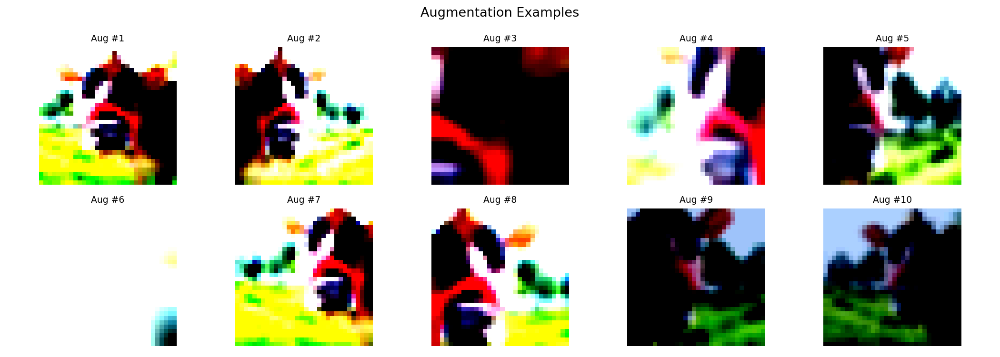

---

## 3. EDA – Dữ liệu Văn bản (20 Newsgroups)

- ~18,000 bài đăng · 20 chủ đề (politics, sports, science, religion…)
- Lọc `remove=('headers','footers','quotes')` → chỉ giữ nội dung chính
- Train: ~11,314 · Test: ~7,532
- Độ dài văn bản dao động lớn (50 → 5,000+ từ) → truncate tại **max_length=256**
- Phân phối class tương đối cân bằng (~550–600 bài/class)

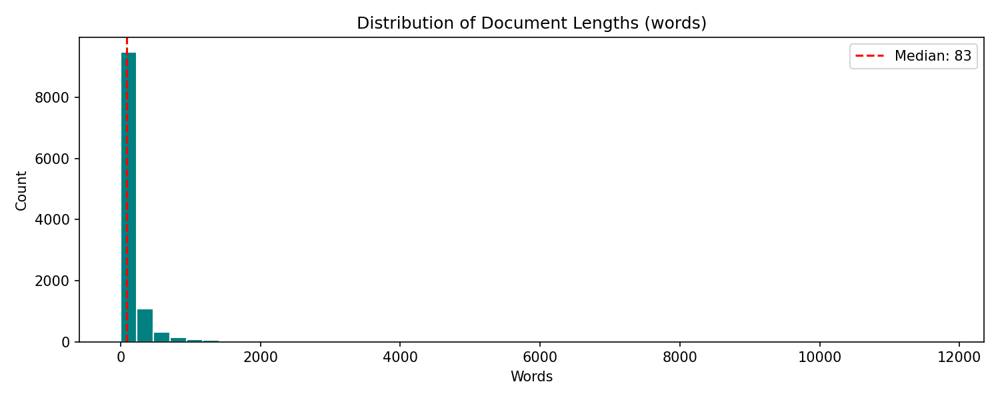

---

## 3. EDA – Dữ liệu Đa phương thức (Flickr30k)

- **31,783 ảnh** thật, mỗi ảnh có **5 captions** do con người viết
- Test split: **1,000 ảnh** (tải từ `AnyModal/flickr30k`)
- Gán nhãn từ captions bằng keyword matching → **10 semantic classes**: people, dog, water, sports, outdoor, horse, bicycle, food, nature, indoor
- Mỗi ảnh đều có cặp (ảnh, caption) thật

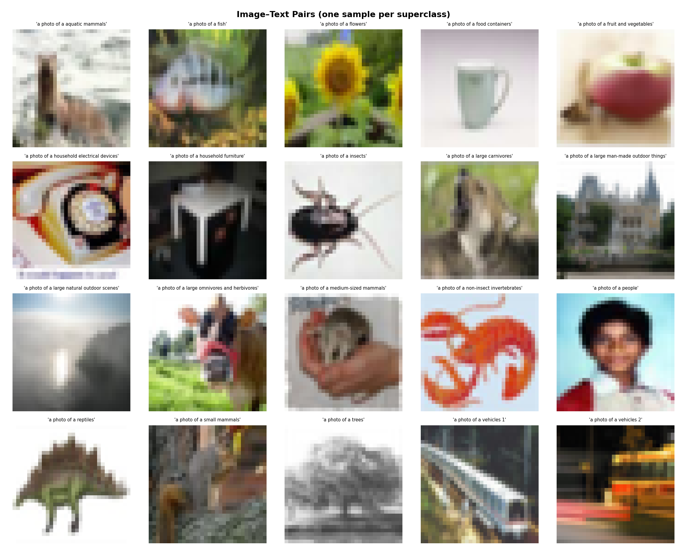
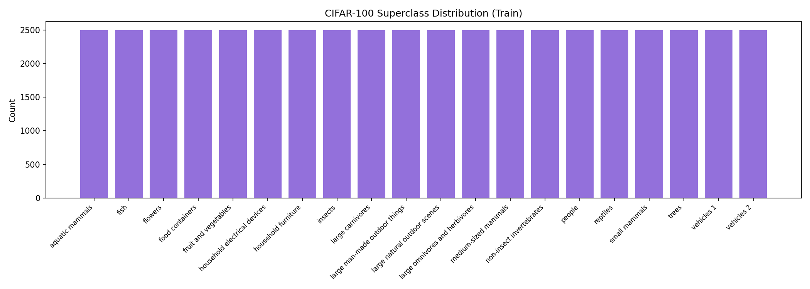

---

## Metrics Đánh giá

| Metric | Công thức |
|---|---|---|
| **Accuracy** | $\frac{\text{số dự đoán đúng}}{\text{tổng số mẫu}}$ |
| **F1-Macro** | $\frac{1}{C}\sum_{c=1}^{C} \frac{2 \cdot P_c \cdot R_c}{P_c + R_c}$ |

### Tại sao dùng cả hai?

- **Accuracy** — trực quan, dễ so sánh tổng thể; nhưng có thể bị lệch nếu model thiên về một số class
- **F1-Macro** — tính F1 riêng từng class rồi lấy trung bình không trọng số → **phát hiện model bỏ sót class hiếm**
- Dataset cân bằng (CIFAR-100: 500/class · 20 Newsgroups: ~550/class · Flickr-10: ~100/class) → Accuracy và F1-Macro thường nhất quán

---

<!-- _class: section-header -->

# Bài toán 1 – Phân loại Ảnh
## ResNet-50 (CNN) vs. ViT-B/16 (Vision Transformer) · CIFAR-100

---

## 4. Bài toán 1 – Cài đặt thực nghiệm

| | ResNet-50 | ViT-B/16 |
|---|---|---|
| **Kiến trúc** | CNN, Residual blocks | Transformer, Patch 16×16 |
| **Tham số** | 25.6M | 86M |
| **Pre-train** | ImageNet-1K (1.2M ảnh) | ImageNet-21K (14M ảnh) |
| **Classification head** | `Dropout(0.3) + FC(2048→100)` | `FC(768→100)` |
| **Fine-tune** | Toàn bộ mạng | Toàn bộ mạng |
| **Learning rate** | `1×10⁻³` | `5×10⁻⁵` (nhỏ hơn để tránh phá vỡ pre-trained features) |
| **Epochs** | 5 | 5 |
| **Batch size** | 128 | 32 |
| **Scheduler** | CosineAnnealingLR | CosineAnnealingLR |
| **Gradient clipping** | max_norm=1.0 | max_norm=1.0 |

> Cả hai được fine-tune toàn bộ trên CIFAR-100.

---

## 4. Bài toán 1 – Kết quả

| Model | Test Accuracy | F1-Macro | Gap |
|---|---|---|---|
| ResNet-50 (CNN) | 44.11% | 0.434 | baseline |
| **ViT-B/16 (Transformer)** | **89.60%** | **0.896** | **+45.49 pp** |

### Phân tích

- ViT-B/16 vượt ResNet-50 gần **2×** (89.60% vs 44.11%)
- **Self-attention toàn cục**: ViT học quan hệ giữa tất cả 196 patch ngay từ layer đầu tiên; ResNet chỉ nhìn vùng 3×3 ở mỗi bước
- ResNet gặp khó khăn do ảnh nhỏ 32×32 — inductive bias của convolution không phù hợp
- Lưu ý: ViT pre-train trên **14M ảnh** (ImageNet-21K) vs ResNet 1.2M → **lợi thế dữ liệu 11×** cần tính đến

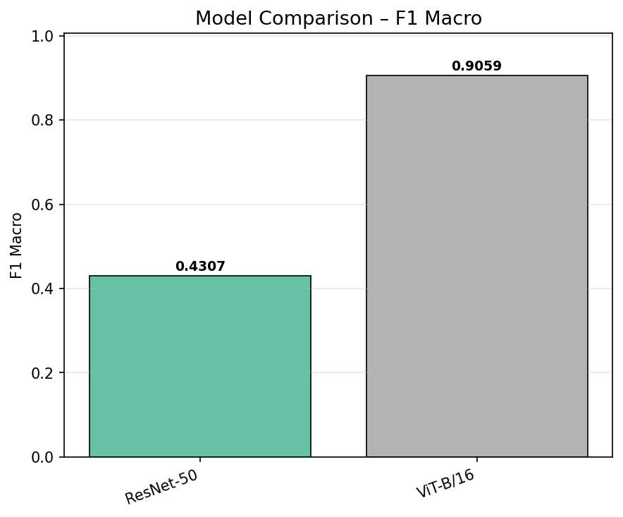

---

## 4. Bài toán 1 – Training Curves: ResNet-50

- Val accuracy tăng ổn định, hội tụ nhanh ở epoch 3–4
- Dấu hiệu nhẹ overfitting ở cuối: train loss tiếp tục giảm nhưng val loss bắt đầu tăng nhẹ

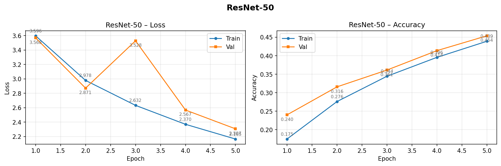

---

## 4. Bài toán 1 – Training Curves: ViT-B/16

- Khởi đầu chậm hơn (epoch 1–2 thấp) — Transformer cần "warm-up" để thích nghi với task mới
- Sau đó tăng nhanh mạnh; val loss không tăng → không overfitting trong 5 epochs

---

## 4. Bài toán 1 – Phân tích Lỗi (Confusion Matrix – ResNet-50)

- Phần lớn lỗi xảy ra **trong cùng superclass**: nhầm `beaver` ↔ `otter`, `bus` ↔ `train`
- Ít lỗi xuyên superclass → mô hình đã học phân biệt ở mức superclass nhưng chưa đủ tinh tế ở fine-grained
- **Nguyên nhân:** độ phân giải 32×32 quá thấp — các class cùng superclass trông gần như giống nhau

---

<!-- _class: section-header -->

# Bài toán 2 – Phân loại Văn bản
## GRU (RNN) vs. DistilBERT (Transformer) · 20 Newsgroups

---

## 5. Bài toán 2 – Cài đặt thực nghiệm

| | GRU | DistilBERT |
|---|---|---|
| **Kiến trúc** | Bidirectional RNN, 2 layers | Transformer, 6 layers |
| **Tham số** | ~4M | 66M |
| **Pre-train** | **Không** — khởi tạo ngẫu nhiên | Wikipedia + BookCorpus (~16GB) |
| **Embedding** | DistilBERT tokenizer, embed_dim=300 | Learned embeddings (pre-trained) |
| **Classification head** | `FC(512→20)` (hidden×2) | `FC(768→20)` |
| **Learning rate** | `1×10⁻³` | `2×10⁻⁵` |
| **Epochs** | 5 | 3 |
| **Batch size** | 64 | 32 |
| **Max sequence length** | 256 tokens | 256 tokens |

> Cả hai cùng dùng `DistilBertTokenizer` (vocab=30,522) để tokenize → **embedding space đồng nhất**, chỉ khác kiến trúc xử lý.

---

## 5. Bài toán 2 – Kết quả

| Model | Test Accuracy | F1-Macro | Gap |
|---|---|---|---|
| GRU (RNN) | 37.85% | 0.361 | baseline |
| **DistilBERT (Transformer)** | **69.04%** | **0.668** | **+31.19 pp** |

### Phân tích

- DistilBERT vượt GRU **+31.2 điểm** — khoảng cách lớn nhất trong 3 domain
- **GRU**: xử lý tuần tự → không song song, khó học long-range dependency ở max_length=256
- **DistilBERT**: self-attention song song toàn chuỗi + pre-train trên 16GB văn bản → representations giàu ngữ nghĩa
- GRU không có pretrained embeddings → phải học từ đầu trên ~11K bài — quá ít để khái quát hóa tốt

> **Kết luận**: Với NLP, **pre-training** là yếu tố quyết định hơn kiến trúc đơn thuần.

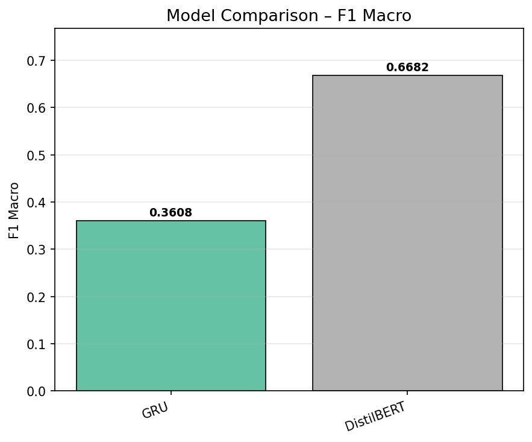

---

## 5. Bài toán 2 – Training Curves: GRU

- Val accuracy đạt ~35–38% rồi bão hòa sớm
- Training loss tiếp tục giảm nhưng val loss tăng nhẹ → overfitting rõ

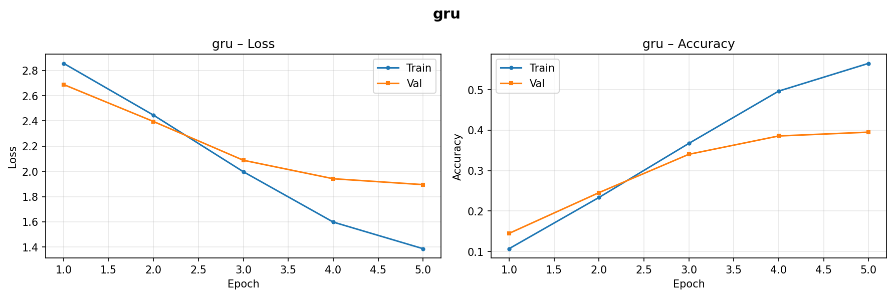

---

## 5. Bài toán 2 – Training Curves: DistilBERT

- Chỉ cần **3 epochs** để đạt 69% — tốc độ hội tụ vượt trội nhờ pretrained representations
- Val loss giảm đều, không có dấu hiệu overfitting trong 3 epochs

---

<!-- _class: section-header -->

# Bài toán 3 – Phân loại Đa phương thức
## CLIP Zero-shot vs. Few-shot · Flickr30k

---

## 6. Bài toán 3 – Phương pháp & Cài đặt

**Dataset:** Flickr30k test split — 1,000 ảnh, **10 classes** (keyword labeling từ captions)

| Phương pháp | Mô tả | Training data |
|---|---|---|
| **Zero-shot** | Prompt `"a photo of a {class}"` → cosine sim | **0 ảnh** |
| **1-shot** | Linear head trên CLIP features | 10 ảnh (1/class) |
| **5-shot** | Linear head trên CLIP features | 50 ảnh (5/class) |
| **10-shot** | Linear head trên CLIP features | 100 ảnh (10/class) |
| **20-shot** | Linear head trên CLIP features | 200 ảnh (20/class) |

> CLIP encoder **frozen hoàn toàn** — chỉ train linear head $W \in \mathbb{R}^{512 \times 10}$

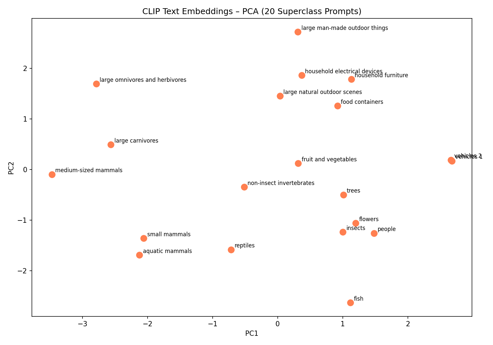

---

## 6. Bài toán 3 – Kết quả Zero-shot vs. Few-shot

| Phương pháp | Train ảnh | **Accuracy** | **F1-Macro** |
|---|---|---|---|
| Zero-shot | 0 | 54.60% | 0.517 |
| 1-shot | 10 | 32.80% | 0.338 |
| 5-shot | 50 | 61.20% | 0.622 |
| 10-shot | 100 | 76.40% | 0.766 |
| **20-shot** | **200** | **93.00%** | **0.932** |

### Phân tích

- **1-shot < Zero-shot**: 1 ảnh/class không đủ ước lượng phân phối → linear head overfit
- **5-shot** vượt zero-shot: đủ signal để học phân tách
- **20-shot = 93%** với chỉ 200 ảnh train → CLIP features **cực kỳ phân ly**

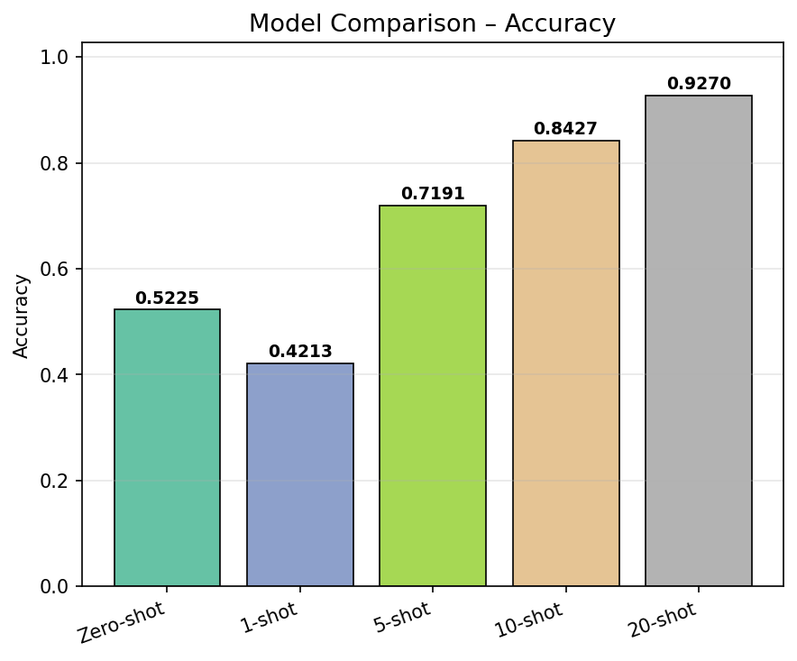
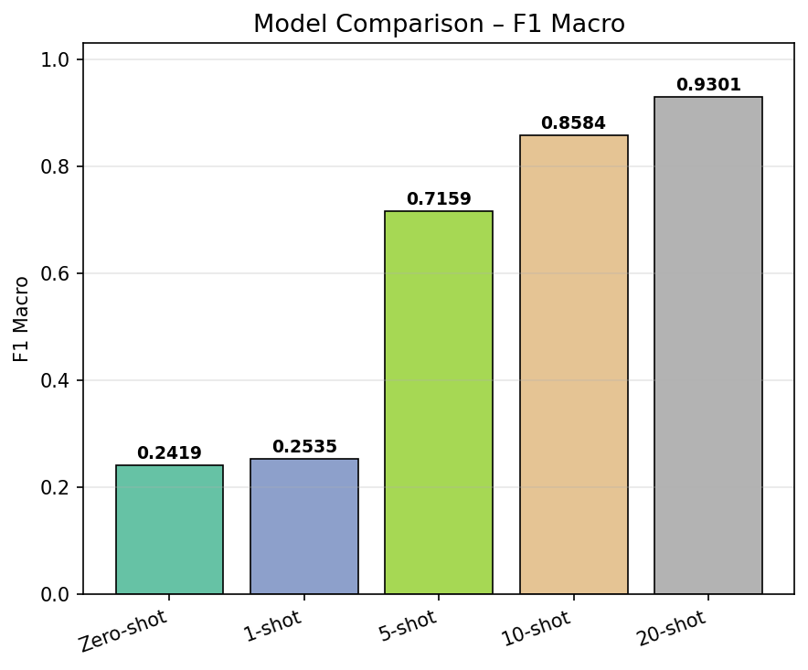

---

<!-- _class: section-header -->

# Kết quả tổng hợp & Kết luận

---

## 8. Kết quả tổng hợp & Kết luận

| Domain | Mô hình CNN/RNN | Mô hình Transformer | Kết quả |
|---|---|---|---|
| Phân loại ảnh | ResNet-50: 44.11% | ViT-B/16: **89.60%** | ViT-B/16 (+45.5 pp) |
| Phân loại văn bản | GRU: 37.85% | DistilBERT: **69.04%** | DistilBERT (+31.2 pp) |
| Đa phương thức | Zero-shot: 54.60% | CLIP 20-shot: **93.00%** | Few-shot vượt trội |

### Ba kết luận chính

1. **Transformer vượt CNN và RNN** trên cả 3 domain nhờ self-attention toàn cục và pre-training quy mô lớn
2. **Pre-trained weights** là yếu tố then chốt — fine-tuning từ pretrained vượt train từ đầu rất xa
3. **CLIP few-shot** đạt 93% accuracy với chỉ 200 ảnh train (20-shot); zero-shot đạt 54.6% mà không cần bất kỳ dữ liệu training nào

---

<!-- _class: title-slide -->

# Cảm ơn thầy đã lắng nghe!

