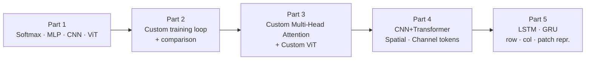

# Chapter 2 — Architecture Engineering from Scratch

Build core deep-learning vision architectures from first principles on CIFAR-100. No pretrained weights.

[](https://pytorch.org/)
[](https://www.cs.toronto.edu/~kriz/cifar.html)

[← back to portfolio hub](../README.md)

---

## Learning path

Five progressive parts that walk from the simplest classifier to a fully-custom Vision Transformer — every line of attention, normalization, and patching written by hand.



## Five parts

| Part | Focus | Models | Notebook |
|:---:|---|---|---|
| 1 | PyTorch fundamentals | Softmax Regression, MLP, SimpleCNN, SimpleViT | [`part1_models.ipynb`](notebooks/part1_models.ipynb) |
| 2 | Custom training loop | Compare all 4 from Part 1 | [`part2_train_compare.ipynb`](notebooks/part2_train_compare.ipynb) |
| 3 | Attention from scratch | `CustomMultiHeadAttention`, `CustomTransformerEncoder`, `CustomViT` | [`part3_custom_transformer.ipynb`](notebooks/part3_custom_transformer.ipynb) |
| 4 | Tokenization variants | CNN+Transformer hybrid, Spatial-token ViT, Channel-token ViT | [`part4_architectures.ipynb`](notebooks/part4_architectures.ipynb) |
| 5 | Sequence models on images | LSTM/GRU with row / column / patch representations | [`part5_lstm_gru.ipynb`](notebooks/part5_lstm_gru.ipynb) |

## Run

```bash
# from repo root, after activating .venv
cd exercise

python scripts/run_part1_2.py                # train all 4 baseline models
python scripts/run_part1_2.py --model cnn    # single model
python scripts/run_part1_2.py --epochs 5     # quick smoke run

python scripts/run_part3.py                  # custom transformer
python scripts/run_part4.py                  # tokenization variants
python scripts/run_part5.py                  # LSTM/GRU on images
```

Recommended order: Part 1 → 2 → 3 → 4 → 5 (each builds on the previous).

Notebooks are regenerated via `python exercise/create_notebooks.py` — do not edit `.ipynb` files directly.

## Expected accuracy on CIFAR-100 (no pretrained weights)

| Model | Test accuracy |
|---|:---:|
| Softmax Regression | ~15–20% |
| MLP | ~35–42% |
| SimpleCNN | ~50–60% |
| SimpleViT / CustomViT | ~35–50% |
| CNN+Transformer hybrid | ~50–58% |
| LSTM/GRU variants | ~35–45% |

Numbers reflect the difficulty of training transformers from scratch on small images — the explicit pedagogical message of this assignment.

## Layout

```
exercise/
├── src/
│   ├── data.py              CIFAR-100 loaders
│   ├── train.py             custom training loop
│   ├── utils.py             metrics, viz
│   ├── models_part1.py      Softmax · MLP · SimpleCNN · SimpleViT
│   ├── models_part3.py      CustomMultiHeadAttention · CustomViT
│   ├── models_part4.py      CNNTransformerHybrid · Spatial/Channel-token ViTs
│   └── models_part5.py      ImageLSTM · ImageGRU
├── notebooks/                5 part notebooks
├── scripts/                  run_part{1_2,3,4,5}.py
├── results/                  checkpoints, plots, metrics (auto-created)
└── create_notebooks.py
```

## Hardware and timing

Auto-selects: CUDA → MPS (Apple Silicon) → CPU.

Approximate wall-clock on Apple M2 (MPS):

| Part | Time |
|---|---|
| Part 1 + 2 | 2–4 h (4 models × 30–100 epochs) |
| Part 3 | ~2 h (100 epochs) |
| Part 4 | ~1.5 h (3 models × 50 epochs) |
| Part 5 | ~1 h (4 configs × 30 epochs) |

Total: ~7–9 hours for all 5 parts on M2 MPS.

---

[← back to portfolio hub](../README.md) · [GitHub Pages](../docs/exercise.html)
