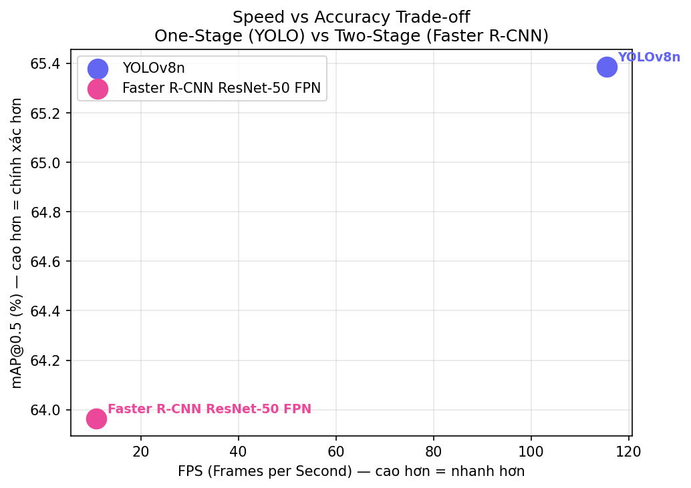
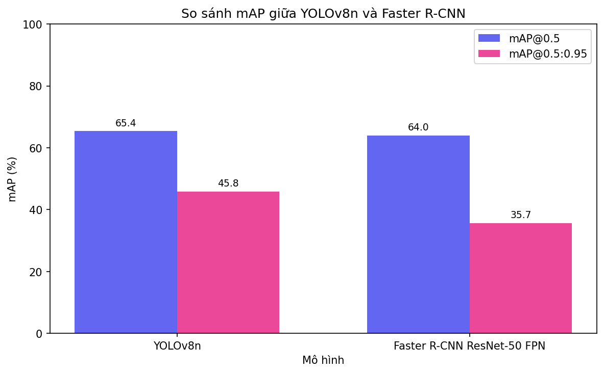
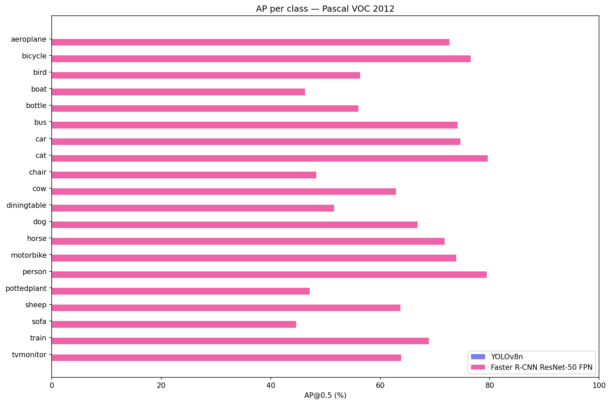
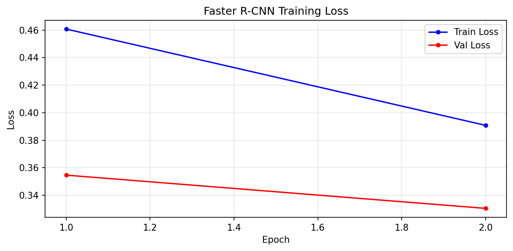

# Chapter 3 — Object Detection: One-Stage vs Two-Stage

Pretrained → fine-tune comparison of YOLOv8n and Faster R-CNN ResNet-50 FPN on Pascal VOC 2012.

[](https://pytorch.org/)
[](https://github.com/ultralytics/ultralytics)
[](notebooks/colab_train.ipynb)

[← back to portfolio hub](../README.md)

---

## Results

2-epoch fine-tune on Tesla T4:

| Model | Type | mAP@0.5 | mAP@.5:.95 | FPS (T4) | Params |
|---|---|:---:|:---:|:---:|:---:|
| YOLOv8n | one-stage | **65.4** | **45.8** | **115.5** | 3.0M |
| Faster R-CNN R-50 FPN | two-stage | 64.0 | 35.7 | 10.9 | 41.4M |

YOLOv8n is 10.6× faster than Faster R-CNN while edging it out by 1.4 points on mAP@0.5.

<p align="center">
  
  
</p>

<details>
<summary>Per-class breakdown — Faster R-CNN</summary>

<br>

| Top 5 | AP@0.5 | Bottom 5 | AP@0.5 |
|---|---|---|---|
| cat | 79.7 | diningtable | 51.6 |
| person | 79.5 | chair | 48.3 |
| bicycle | 76.5 | pottedplant | 47.1 |
| car | 74.7 | boat | 46.2 |
| bus | 74.2 | sofa | 44.6 |

Easy classes have many training samples and clear visual patterns; hard ones suffer from occlusion (sofa, chair, diningtable) and shape variability (pottedplant, boat).

<p align="center">
  
</p>

</details>

<details>
<summary>Training loss curves — Faster R-CNN</summary>

<br>

<p align="center">
  
</p>

</details>

## Quick start

```bash
# from repo root, after activating .venv
pip install ultralytics>=8.0.0 pycocotools>=2.0.6 opencv-python>=4.8.0
```

VOC 2012 (~2 GB) auto-downloads on first run via `torchvision.datasets.VOCDetection`.

```bash
# Smoke tests (~5 min each)
python exercise_2/scripts/run_finetune_yolo.py  --dry-run
python exercise_2/scripts/run_finetune_frcnn.py --dry-run

# Full training (defaults to 2 epochs)
python exercise_2/scripts/run_finetune_yolo.py  --epochs 2
python exercise_2/scripts/run_finetune_frcnn.py --epochs 2

# Generate comparison plots from saved metrics
python exercise_2/scripts/run_compare.py
```

> On Apple Silicon, full Faster R-CNN training is impractically slow (~93 h/epoch) because torchvision's RoI/NMS ops fall back to CPU. Use [`notebooks/colab_train.ipynb`](notebooks/colab_train.ipynb) on Google Colab T4 — the full pipeline finishes in ~2.5 hours.

## Notebooks

```bash
python exercise_2/create_notebooks.py   # regenerate all
```

| Notebook | Topic |
|---|---|
| [`nb1_eda.ipynb`](notebooks/nb1_eda.ipynb) | dataset stats, class distribution, bbox analysis |
| [`nb2_data_pipeline.ipynb`](notebooks/nb2_data_pipeline.ipynb) | DataLoader, augmentation, VOC → YOLO conversion |
| [`nb3_train_compare.ipynb`](notebooks/nb3_train_compare.ipynb) | architecture summary, train both, mAP table |
| [`nb4_results.ipynb`](notebooks/nb4_results.ipynb) | mAP plots, per-class AP, qualitative examples |
| [`nb5_extensions.ipynb`](notebooks/nb5_extensions.ipynb) | FPS benchmark, feature maps, Gradio demo |
| [`colab_train.ipynb`](notebooks/colab_train.ipynb) | full pipeline on Colab T4 |

## Architecture

```mermaid
flowchart TB
    subgraph DATA[Pascal VOC 2012]
        IMGS[JPEGImages<br/>5,717 train · 5,823 val]
        XML[Annotations<br/>XML bbox files]
    end

    subgraph PREP[Preparation]
        VOC2YOLO[VOC XML to YOLO<br/>normalized class xc yc w h]
        IMGNET[ImageNet normalize<br/>+ HFlip + ColorJitter]
    end

    subgraph YOLO[YOLOv8n one-stage]
        Y1[CSPDarknet backbone]
        Y2[PANet neck]
        Y3[anchor-free DFL head]
    end

    subgraph FRCNN[Faster R-CNN two-stage]
        F1[ResNet-50 FPN backbone]
        F2[RPN region proposals]
        F3[ROI head: classify + box reg]
    end

    subgraph EVAL[Evaluation]
        mAP[mAP@0.5 · mAP@.5:.95<br/>via pycocotools]
        FPS[FPS benchmark<br/>warmup + 50 runs]
    end

    IMGS & XML --> VOC2YOLO --> YOLO
    IMGS & XML --> IMGNET --> FRCNN
    YOLO --> EVAL
    FRCNN --> EVAL
```

## Layout

```
exercise_2/
├── src/
│   ├── data.py              VOC dataset, YOLO format conversion, transforms
│   ├── models.py            YOLOv8 wrapper, Faster R-CNN with replaced head
│   ├── train.py             fit_frcnn (SGD+StepLR), train_yolov8 (ultralytics)
│   ├── evaluate.py          mAP via pycocotools, FPS benchmark, TP/FP/FN
│   └── utils.py             visualize_detections, plots, JSON I/O
├── scripts/
│   ├── run_finetune_yolo.py
│   ├── run_finetune_frcnn.py
│   └── run_compare.py
├── notebooks/                5 task notebooks + colab_train.ipynb
├── results/
│   ├── checkpoints/          frcnn_voc.pth (166 MB)
│   ├── metrics/              yolo_results.json, frcnn_results.json
│   └── plots/                4 PNGs
└── create_notebooks.py
```

## One-stage vs two-stage

|  | YOLOv8n (one-stage) | Faster R-CNN (two-stage) |
|---|---|---|
| Pipeline | single grid-based prediction | RPN → ROI heads |
| Speed | real-time | offline-only on CPU |
| Accuracy ceiling | high | higher with longer training |
| Best use case | real-time apps, edge devices | offline analysis, medical imaging |
| Params | 3M (nano) | 41M |

YOLOv8 is the practical choice for most applications; Faster R-CNN remains the academic reference and shines when accuracy at high IoU thresholds matters.

---

[← back to portfolio hub](../README.md) · [GitHub Pages](../docs/exercise_2.html) · [Colab notebook](notebooks/colab_train.ipynb)
